# Machine Learning Pipeline Flow Diagram
## Personalized Meal Recommendation System

This document visualizes the complete end-to-end machine learning pipeline for meal recommendations, from user input to AI-generated personalized responses.

---

## Complete ML Pipeline Flow


---

## Detailed Component Breakdown

### 1. User Input Processing


**Features Extracted:**
- Age, gender, weight, height (numerical)
- Primary goal (categorical: Weight Loss, Muscle Gain, etc.)
- Dietary restrictions (binary flags: vegan, gluten-free, nut-free)
- Weekly budget (numerical → cost_per_serving threshold)
- Favorite cuisines (categorical, optional filter)

---

### 2. Data Preprocessing Pipeline


**Preprocessing Techniques:**
- **Imputation**: Median for numerical (robust to outliers)
- **Scaling**: StandardScaler ensures Gini splits not dominated by high-magnitude features
- **Encoding**: OneHot for categories (drop='first' prevents multicollinearity)
- **Derived Features**: Capture non-linear nutrient relationships

---

### 3. Feature Selection Process

```mermaid
graph TD
    A[25 Initial Features] --> B[SelectKBest chi2]
    B --> C[Compute chi² Statistic]
    C --> D[chi² = Σ Observed-Expected ² / Expected]
    D --> E[Rank Features by Score]
    E --> F[Select Top 10 Features]
    F --> G[Reduced Feature Space]
    G --> H[Benefits: Less Noise Faster Training Better Generalization]
```


**Selected Features (Example):**
1. protein_g (chi²=145.2)
2. fiber_g (chi²=98.7)
3. sugars_g (chi²=87.3)
4. nutrient_density (chi²=76.5)
5. cost_per_serving (chi²=65.1)
6. calories (chi²=54.8)
7. sodium_mg (chi²=43.2)
8. sugar_to_carb_ratio (chi²=38.9)
9. food_category_grains (chi²=29.4)
10. is_vegan (chi²=21.7)

---

### 4. Random Forest Training Flow


**Training Process:**
1. **GridSearchCV**: Exhaustive search over 27 parameter combinations
2. **5-Fold CV**: Train on 4 folds, validate on 1 (rotates 5 times)
3. **Scoring**: F1-macro balances precision/recall for imbalanced classes
4. **Best Model**: Highest mean CV F1-score across all folds

---

### 5. Prediction & Ranking Logic

```mermaid
graph TD
    A[New User Query] --> B[Load Trained Model]
    B --> C[Load Food Database]
    C --> D[Apply User Filters]
    
    D --> E[Preprocess Features]
    E --> F[Model.predict_proba]
    F --> G[Get P y=1 for Each Food]
    
    G --> H{Goal Adjustment}
    H -->|Weight Loss| I[Boost Low-Cal × 1.2]
    H -->|Muscle Gain| J[Boost High-Protein × 1.3]
    H -->|Heart Health| K[Boost Low-Sodium × 1.2]
    
    I --> L[Adjusted Probabilities]
    J --> L
    K --> L
    
    L --> M[Sort Descending]
    M --> N[Select Top-5]
    N --> O[Format JSON]
    O --> P[Return Recommendations]
```


**Probability Formula:**
```
P(fit=1|food) = (1/N) Σ(i=1 to N) P_i(food|tree_i)
```
Where N = n_estimators (e.g., 100 trees)

**Adjusted Probability (for Weight Loss):**
```
P_adjusted = P_raw × 1.2  if (calories < 300 AND protein > 15g)
P_adjusted = clip(P_adjusted, 0, 1)
```

---

### 6. Integration with Ollama AI


**Context Injection Example:**
```
User Query: "I need a healthy breakfast"
ML Context: "Recommended meals (ranked by fit score):
1. Greek Yogurt Parfait (0.89): High protein (18g), low sugar (3g), budget $1.50
2. Oatmeal with Berries (0.85): High fiber (8g), vegan, budget $1.20
3. Veggie Omelet (0.82): High protein (22g), low carb (5g), budget $2.00"

Final Prompt to Ollama:
"[Context] {ML rankings} [Query] I need a healthy breakfast [Goal] Weight Loss [Restrictions] Vegan"

Ollama Output:
"Based on your goals, I recommend starting with Oatmeal with Berries! 🥣
It's high in fiber (8g) to keep you full, completely vegan, and only $1.20 per serving.
Add some chia seeds for extra protein and omega-3s. Want the recipe?"
```

---

## Mathematical Foundations

### Gini Impurity (Decision Tree Splits)
```
G(node_m) = 1 - Σ(k=1 to K) p_mk²

where:
- p_mk = proportion of class k in node m
- K = number of classes (2 for binary: fit/unfit)
```

**Example:**
- Node with 100 samples: 60 fit, 40 unfit
- G = 1 - (0.6² + 0.4²) = 1 - (0.36 + 0.16) = 0.48

**Interpretation:** Lower Gini = purer node (better split)

### Ensemble Aggregation
```
P(y=1|x) = (1/N) Σ(i=1 to N) P_i(y=1|x)

Variance Reduction:
σ_ensemble ≈ σ_tree / √N
```

**Why Bagging Works:**
- Individual trees have high variance (overfit)
- Averaging N uncorrelated predictions reduces variance by factor of √N
- For N=100 trees: variance reduced ~10x

### Feature Importance (Gini Decrease)
```
Importance_j = (1/N_trees) Σ(tree=1 to N_trees) Σ(node∈tree where j used) (samples_node / total_samples) × ΔGini

where:
- ΔGini = Gini_before_split - Gini_after_split
```

**Interpretation:** Higher importance = feature contributes more to reducing impurity across all trees

---

## Performance Metrics

### F1-Score (Harmonic Mean)
```
Precision = TP / (TP + FP)
Recall = TP / (TP + FN)
F1 = 2 × (Precision × Recall) / (Precision + Recall)
```

**Why F1 over Accuracy:**
- Accuracy misleading for imbalanced data (64% fit, 36% unfit)
- F1 balances precision (avoid false positives) and recall (find all positives)
- Macro-averaging: F1_macro = (F1_class0 + F1_class1) / 2

### ROC-AUC (Ranking Quality)
```
AUC = ∫(0 to 1) TPR(FPR) d(FPR)

where:
- TPR = True Positive Rate = TP / (TP + FN)
- FPR = False Positive Rate = FP / (FP + TN)
```

**Interpretation:**
- AUC = 0.5: Random guessing
- AUC > 0.80: Good ranking (important for top-k recommendations)
- AUC = 1.0: Perfect separation

---

## SMOTE Oversampling


**Formula:**
```
x_synthetic = x_i + λ × (x_knn - x_i)
where λ ~ Uniform(0, 1)
```

**Why SMOTE:**
- Random oversampling duplicates → overfitting
- SMOTE creates new samples along feature space lines → generalization
- Applied only to training set (test set unchanged for unbiased eval)

---

## Error Analysis & Optimization

### Common Failure Modes
1. **Low Precision**: Too many false positives (unfit foods ranked high)
   - **Solution**: Increase min_samples_split, reduce max_depth
2. **Low Recall**: Missing fit foods (false negatives)
   - **Solution**: Increase n_estimators, apply SMOTE
3. **Overfitting**: High train F1, low test F1
   - **Solution**: Regularization via max_depth, min_samples_leaf

### Optimization Techniques Applied
- **GridSearchCV**: Exhaustive hyperparameter search
- **SMOTE**: Balance classes (64/36 → 50/50)
- **Feature Selection**: Reduce noise (25 → 10 features)
- **Cross-Validation**: 5-fold ensures robust evaluation
- **Goal Adjustment**: Post-hoc probability boost for user preferences

---

## Integration Testing Workflow


---

## File Structure Summary

```
backend/ml/
├── preprocess.py        # Data preprocessing & augmentation
├── train.py             # Model training with GridSearchCV
├── predict.py           # Real-time prediction endpoint
├── ml-flow.md           # This documentation
├── processed_data.csv   # Full dataset with labels
├── train_data.csv       # Training set (after SMOTE)
├── test_data.csv        # Test set (stratified)
├── rf_model.pkl         # Trained Random Forest
├── preprocessor.pkl     # Fitted ColumnTransformer
├── feature_selector.pkl # Fitted SelectKBest
├── feature_names.json   # Feature metadata
└── training_metrics.json # Performance metrics
```

---

## Next Steps

1. **Run Pipeline**: 
   ```bash
   python backend/ml/preprocess.py
   python backend/ml/train.py
   ```

2. **Test Prediction**:
   ```bash
   echo '{"userProfile": {"primaryGoal": "Weight Loss", "dietaryRestrictions": ["Vegan"], "weeklyBudget": 75}, "query": "breakfast"}' | python backend/ml/predict.py
   ```

3. **Integrate with Backend**: See `/backend/controllers/recController.ts`

4. **Monitor Performance**: Track metrics in `training_metrics.json`

---

**Last Updated:** October 2025  
**Model Version:** 1.0  
**Target F1-Score:** > 0.80 (achieved: see training_metrics.json)
